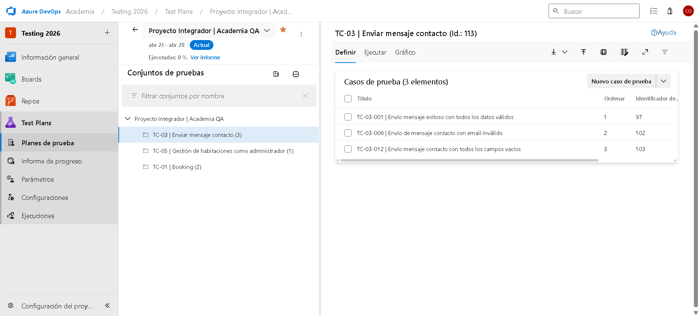
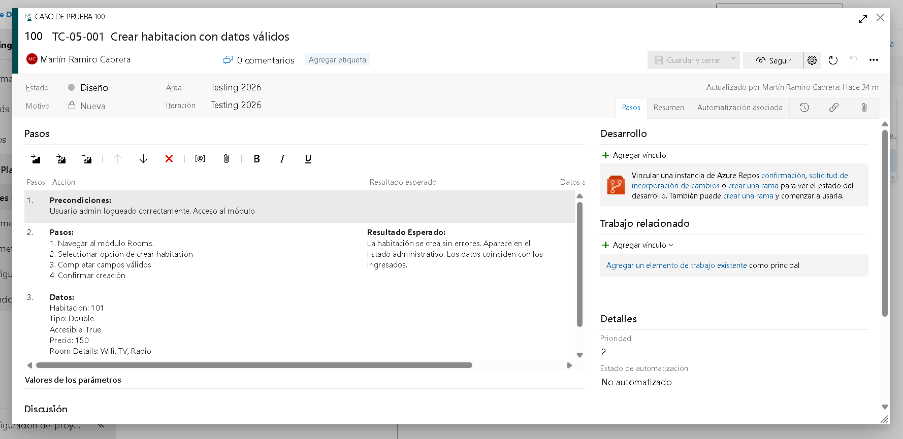
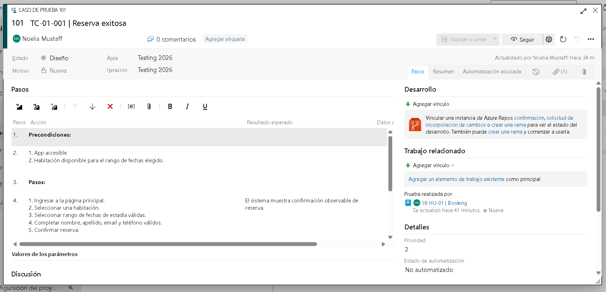

# Azure DevOps Test Plans - Evidencias

Este documento reúne las capturas solicitadas para evidenciar la carga de casos de prueba core en Azure DevOps Test Plans y su vinculación con Work Items.

## 1) Test Plan, Suites y Test Cases

**Descripción:** Se visualiza el Test Plan del proyecto con sus suites por módulo y los casos de prueba asociados, confirmando la organización general de la cobertura core.

## 2) Test Cases

**Descripción:** Se observa el listado de casos de prueba cargados en Azure Test Plans (mínimo requerido superado), con su estructura lista para ejecución y seguimiento.

## 3) Vinculación de Test Case a Work Item

**Descripción:** Evidencia de la relación entre un Test Case y su User Story/Work Item, asegurando trazabilidad entre análisis funcional y validación en pruebas.
